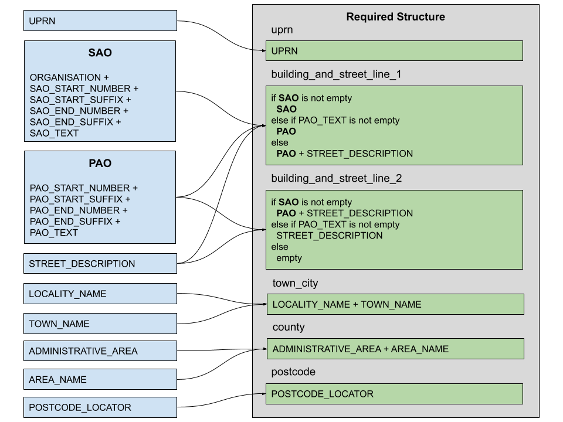

# The address lookup process

The address lookup process consists of 4 main parts:

  1. The user enters a postcode. The Ordnance Survey (OS) Places API is then called and a number of addresses with that postcode are returned.  These are then displayed to the user in a dropdown.

  2. The user selects an address from the dropdown. This captures the entire address object, including the Unique Property Reference Number (UPRN). The address is then converted from the format as presented by the API into the required one.

  3. The user can edit the address.  It is desirable to maintain the UPRN irrespective of the changes made by the user. So, it is removed only when it is absolutely necessary to do so, i.e. we can no longer trust that the address as entered still matches the address associated with that UPRN.

  4. The user submits the address to be stored.

There are two points in the process when the user can choose to opt-out of selecting an address, by clicking a link and then be presented with a form into which they can enter their address manually.  This link is shown:

  1. if no results are returned for the entered postcode, and

  2. at the same time as the dropdown, so that the user can click it in cases where the desired address is not present in the dropdown.

In cases where an address is manually entered, the UPRN is not captured, so will be empty in the final stored data.


## Conversion

The OS Places API returns addresses in the following structure:

| OS Places API Structure |
|-------------------------|
| UPRN                    |
| SAO_START_NUMBER        |
| SAO_START_SUFFIX        |
| SAO_END_NUMBER          |
| SAO_END_SUFFIX          |
| SAO_TEXT                |
| PAO_START_NUMBER        |
| PAO_START_SUFFIX        |
| PAO_END_NUMBER          |
| PAO_END_SUFFIX          |
| PAO_TEXT                |
| ORGANISATION            |
| STREET_DESCRIPTION      |
| LOCALITY_NAME           |
| TOWN_NAME               |
| ADMINISTRATIVE_AREA     |
| AREA_NAME               |
| POSTCODE_LOCATOR        |

Stored addresses are required to be in the this structure:

| Required Structure         |
|----------------------------|
| uprn                       |
| building_and_street_line_1 |
| building_and_street_line_two |
| town_city                  |
| county                     |
| postcode                   |

As the two structures differ significantly, conversion is required between the two.  The following diagram describes the conversion logic.



<p><center><strong>Address conversion</strong></center></p>

## Primary and Secondary address objects

The OS Places API contains two blocks of sub-address elements: one set beginning `PAO_` and the other set beginning `SAO_`.  These identify the Primary Address Object (PAO) and the Secondary Address Object (SAO). All of these fields are optional for an address.

The easiest way to understand how these data objects function is to briefly describe the delivery process:

  * The first part of the postcode - the Outward code (e.g. __E1__) is used to route the mail to the correct postal delivery office.

  * The second part of the postcode - the Inward code (e.g. __8QS__) is used tell the postal delivery office which delivery round the address is on (e.g. __Whitechapel High Street__).

  * There can be many buildings within a single delivery round, so the PAO is used to identify a specific building - the primary address (e.g. __10 Whitechapel High Street__).

  * Finally, the SAO is used to identify the area within the primary address (e.g. __Office Suite 5__).

Internally, we concatenate the individual elements of the PAO into a single field (called `PAO`). The same is done with the SAO - with the addition of the `ORGANISATION` field.

## Comparison

The user is allowed to edit the converted address. We need to retain the UPRN against any changes the user might make. In order to do so, we need to compare the known - selected - address with the results of the users edit.

The logic for doing this comparison can be boiled down into the following...

```ruby
if SAO.present?
  known_address.lines_one_two_and_postcode == edited_address.lines_one_two_and_postcode
else
  known_address.lines_one_two_and_postcode == edited_address.lines_one_two_and_postcode ||
  known_address.line_one_and_postcode == edited_address.line_one_and_postcode
end
```

If `false` is returned, the UPRN is removed when the address is submitted.
